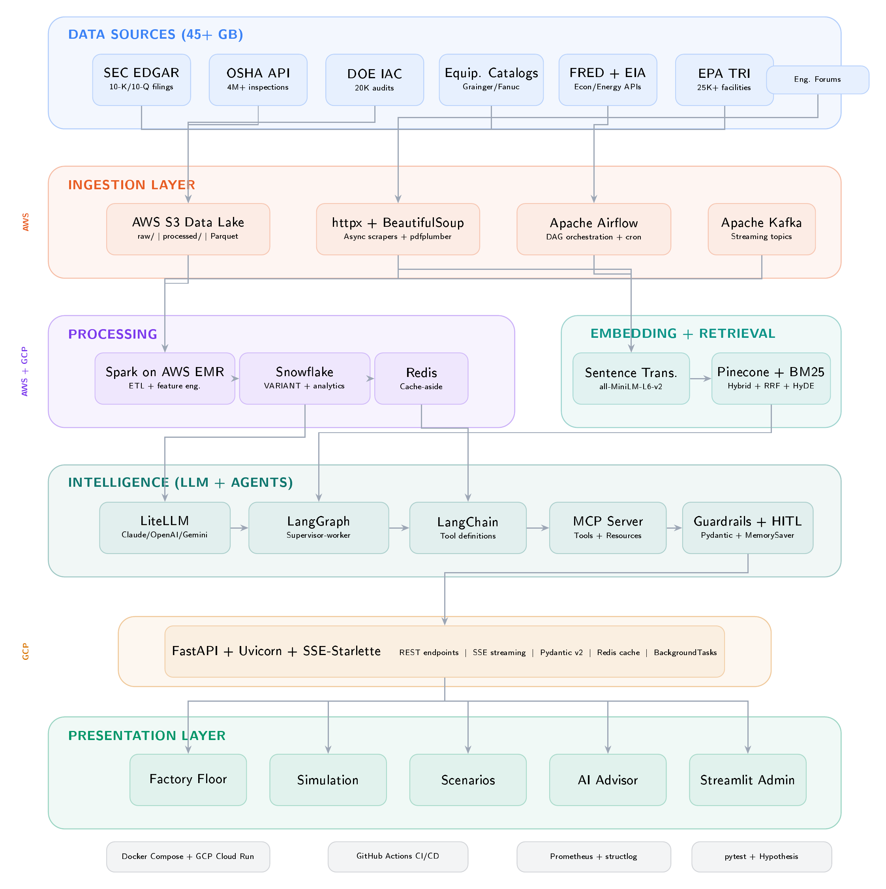

# Industrial Digital Twin: Big Data-Driven Factory Simulation & LLM-Powered Predictive Analytics

[](https://python.org)
[](https://fastapi.tiangolo.com)
[](https://react.dev)
[](./LICENSE)

> **DAMG 7245 — Big-Data Systems and Intelligence Analytics**
> Northeastern University · Spring 2026

A cloud-native Digital Twin platform that ingests 45+ GB of real-world industrial data from 7 sources, processes it through distributed pipelines, and uses LLM-powered multi-agent analysis (LangGraph + LiteLLM) with RAG retrieval (Pinecone + BM25) to deliver actionable manufacturing intelligence—all through an interactive React-based factory simulation interface.

---

## Architecture



The platform follows a seven-layer design:

1. **Data Sources (45+ GB)** — SEC EDGAR, OSHA, DOE IAC, equipment catalogs, FRED + EIA, EPA TRI, engineering forums
2. **Ingestion Layer** — AWS S3, httpx + BeautifulSoup async scrapers, Apache Airflow orchestration, Apache Kafka streaming
3. **Processing Layer** — Spark on AWS EMR, Snowflake (VARIANT + analytics), Redis (cache-aside)
4. **Embedding + Retrieval** — Sentence Transformers (all-MiniLM-L6-v2), Pinecone + BM25 hybrid search with RRF and HyDE
5. **Intelligence Layer** — LiteLLM (Claude/OpenAI/Gemini), LangGraph (supervisor-worker agents), LangChain tool definitions, MCP server, guardrails + HITL
6. **API Layer** — FastAPI + Uvicorn + SSE-Starlette with Pydantic v2 validation
7. **Presentation Layer** — React Digital Twin UI (factory floor, simulation, scenarios, AI advisor) + Streamlit admin

---

## Team

| Name | Role | Responsibilities |
|------|------|-----------------|
| **Ayush Patil** | ETL & Data Lead | Spark pipelines, Airflow DAGs, OSHA/EPA/DOE ingestion, Snowflake schema, Kafka streaming, data quality |
| **Raghavendra Prasath Sridhar** | LLM & Cloud Architect | LangGraph agents, LiteLLM routing, Pinecone + BM25 RAG, MCP server, guardrails, AWS EMR + GCP Cloud Run |
| **Piyush Kunjilwar** | Frontend & QA Lead | React UI, FastAPI backend, SEC EDGAR + catalog scraping, Docker Compose, pytest + Hypothesis, CI/CD |

**Attestation:** We attest that we haven't used any other students' work in our assignment and abide by the policies listed in the Student Handbook.

---

## Project Structure

```
FinalProjectProposal/
├── backend_service/                 # FastAPI backend (Poetry-managed)
│   ├── __init__.py
│   ├── main.py                      # FastAPI app, routes, middleware
│   ├── config.py                    # Pydantic Settings (all env vars)
│   ├── models.py                    # Pydantic v2 request/response schemas
│   ├── sources.py                   # 12 live data source adapters
│   ├── chat.py                      # Multi-provider LLM chat (Claude → GPT-4o → Gemini)
│   └── rag.py                       # Pinecone + Voyage AI RAG pipeline
│
├── industrial-digital-twin/         # React/Vite frontend
│   ├── src/
│   │   ├── App.jsx                  # Main app (5 tabs: Floor, Sim, Advisor, Pipeline, Admin)
│   │   ├── api.js                   # FastAPI client
│   │   ├── data/demoData.js         # Fallback demo data
│   │   └── main.jsx                 # React entry point
│   ├── tests/
│   │   └── ui-smoke.spec.js         # Playwright E2E tests
│   ├── package.json
│   └── vite.config.js
│
├── tests/
│   └── test_chat_context.py         # Backend unit tests
│
├── .env.example                     # Environment variable template
├── pyproject.toml                   # Poetry dependency management
├── architecture_diagram.png         # System architecture (TikZ-rendered)
├── FinalProject_Proposal_*.pdf      # Full LaTeX proposal document
└── README.md
```

---

## Data Sources

Every source requires a non-trivial acquisition pipeline — API pagination, async scraping, PDF parsing, or bulk download. No pre-cleaned CSV files.

| Source | Acquisition Method | Est. Size | Description |
|--------|-------------------|-----------|-------------|
| **SEC EDGAR** | `sec-edgar-downloader` + `pdfplumber` + `httpx` | ~8 GB | 10-K/10-Q filings from 50+ manufacturers; NLP extraction of capex, depreciation, maintenance expenses |
| **OSHA Inspections** | DOL REST API (paginated) + OSHA.gov scraping | ~12 GB | 4M+ workplace inspection records; SHA-256 dedup; NAICS manufacturing code filtering |
| **DOE IAC Database** | Bulk workbook download + schema joins | ~2 GB | 20,000+ real energy audits of manufacturing facilities by DOE engineers |
| **Equipment Catalogs** | `httpx` async crawler + `BeautifulSoup` | ~15 GB | Grainger, FANUC, ABB product specs, pricing, maintenance intervals |
| **FRED + EIA APIs** | REST APIs + Airflow daily refresh | ~500 MB | Manufacturing PMI, commodity prices, electricity rates by state |
| **EPA TRI** | Bulk CSV + REST API + geospatial enrichment | ~5 GB | 25,000+ facility-level environmental compliance records |
| **Engineering Forums** | `httpx` + `BeautifulSoup` + NLP classification | ~3 GB | Stack Exchange Engineering, Reddit r/PLC, r/manufacturing |

**Additional live sources:** NASA POWER (plant-site weather), SerpAPI (market news), Glassdoor (company context via RapidAPI).

---

## Tech Stack

### Backend
- **Runtime:** Python 3.11+
- **Framework:** FastAPI + Uvicorn (ASGI) + SSE-Starlette
- **Validation:** Pydantic v2 (BaseModel, Field, field_validator, model_validator)
- **LLM Routing:** Direct multi-provider with automatic fallbacks (Anthropic Claude → OpenAI GPT-4o → Google Gemini)
- **Embeddings:** Voyage AI (voyage-4-lite, 1024-dim)
- **Vector Store:** Pinecone (managed, cosine similarity, metadata filtering)
- **RAG Pipeline:** PDF chunking → Voyage embeddings → Pinecone index → retrieval → LLM generation with citation tracking
- **Caching:** In-memory TTL-based caching for dashboard and chat responses
- **HTTP Client:** httpx (async, timeout-configured, User-Agent compliant)
- **Document Parsing:** pypdf, BeautifulSoup, regex-based section extraction
- **Config:** pydantic-settings with `.env` file support

### Frontend
- **Framework:** React 18 + Vite
- **Charts:** Recharts (area, bar, pie, radar, line charts)
- **Icons:** Lucide React
- **Testing:** Playwright (E2E smoke tests)

### Infrastructure (Target Architecture)
- **Cloud:** AWS S3 + EMR, GCP Cloud Run
- **Database:** Snowflake (VARIANT type, compound constraints)
- **Orchestration:** Apache Airflow (DAG scheduling, retry policies)
- **Streaming:** Apache Kafka
- **Caching:** Redis (cache-aside pattern, TTL expiration)
- **Monitoring:** Prometheus (Counter, Histogram, Gauge) + structlog
- **CI/CD:** GitHub Actions
- **Containerization:** Docker + Docker Compose

---

## API Endpoints

| Method | Path | Description |
|--------|------|-------------|
| `GET` | `/api/health` | Service health check |
| `GET` | `/api/dashboard` | Aggregated dashboard payload for the React UI |
| `GET` | `/api/sources` | All current source snapshots |
| `GET` | `/api/sources/{source_key}` | Inspect a single source by key |
| `GET` | `/api/dataset-profile` | Dataset size, source universe, and join-key metadata |
| `GET` | `/api/pipeline/status` | Pipeline stage statuses, RAG readiness, and dataset profile |
| `GET` | `/api/capabilities` | Configured providers, integrations, and API surface |
| `POST` | `/api/chat` | AI advisor chat (multi-provider LLM with RAG context) |
| `GET` | `/api/rag/status` | Pinecone index readiness and document count |
| `POST` | `/api/rag/reindex` | Force full RAG reindex from latest source data |

---

## Quick Start

### Prerequisites
- Python 3.11+
- Node.js 18+
- [Poetry](https://python-poetry.org/docs/#installation)

### 1. Clone and configure

```bash
git clone https://github.com/BigDataIA-Spring26-Team-1/FinalProjectProposal.git
cd FinalProjectProposal
cp .env.example .env
# Edit .env with your API keys (at minimum: ANTHROPIC_API_KEY)
```

### 2. Start the backend

```bash
poetry install
poetry run uvicorn backend_service.main:app --reload --host 0.0.0.0 --port 8000
```

The API is now running at `http://localhost:8000`. Verify with:
```bash
curl http://localhost:8000/api/health
```

### 3. Start the frontend

```bash
cd industrial-digital-twin
npm install
npm run dev
```

Open `http://localhost:5173` in your browser.

### 4. (Optional) Run tests

```bash
# Backend tests
poetry run pytest tests/ -v

# Frontend E2E tests
cd industrial-digital-twin
npx playwright install
npx playwright test
```

---

## Environment Variables

Copy `.env.example` to `.env` and configure:

| Variable | Required | Description |
|----------|----------|-------------|
| `ANTHROPIC_API_KEY` | Yes | Primary LLM provider for AI advisor |
| `OPENAI_API_KEY` | Recommended | Fallback LLM provider |
| `GEMINI_API_KEY` | Optional | Tertiary fallback provider |
| `VOYAGE_API_KEY` | Recommended | Embedding provider for RAG retrieval |
| `PINECONE_API_KEY` | Recommended | Managed vector store for RAG |
| `FRED_API_KEY` | Optional | Federal Reserve economic data |
| `EIA_API_KEY` | Optional | Energy Information Administration |
| `DOL_API_KEY` | Optional | Authenticated OSHA data access |
| `SERPAPI_KEY` | Optional | Market news and search expansion |
| `RAPIDAPI_KEY` | Optional | Glassdoor company context |

Sources that don't require API keys (SEC EDGAR, EPA TRI, DOE IAC, NASA POWER, Stack Exchange, Reddit public, catalog scrapers) work out of the box.

---

## LLM & RAG Architecture

### Multi-Provider Chat
The advisor automatically routes through available providers:
1. **Anthropic Claude Sonnet** (primary) — complex analysis, RAG-augmented responses
2. **OpenAI GPT-4o** (fallback) — activates if Claude is unavailable
3. **Google Gemini** (tertiary) — final fallback for resilience

### RAG Pipeline
1. **Indexing:** Proposal PDF + codebase + live source snapshots → chunked (1200 chars, 160 overlap) → Voyage AI embeddings → Pinecone upsert
2. **Retrieval:** User query → Voyage embedding → Pinecone top-k search → context assembly
3. **Generation:** Retrieved context + factory state + chat history → LLM prompt → streamed response with citations

The RAG index auto-builds on first chat request or can be manually triggered via `POST /api/rag/reindex`.

---

## React UI Overview

The frontend provides 5 interactive views:

- **Factory Floor** — Visual production line designer: add/remove machines (CNC, lathe, press, welder, robot arm, QC station), adjust worker counts, configure shift parameters and cost inputs
- **Simulate** — Run time-based factory simulation with production/efficiency/cost charts (area, pie, bar via Recharts)
- **Scenarios** — Save configurations, rename them, and compare side-by-side with radar charts and bar chart overlays
- **AI Advisor** — Chat interface connected to the FastAPI `/api/chat` endpoint; shows LLM provider status, RAG retrieval state, and guardrail indicators
- **Data Pipeline** — Live source status dashboard showing all 12 data integrations, row counts, pipeline stages, and RAG index health

---

## Development

### Code Quality
```bash
# Lint backend
poetry run ruff check backend_service/

# Format check
poetry run ruff format --check backend_service/
```

### Adding a New Data Source
1. Add a new adapter method in `backend_service/sources.py`
2. Register it in the `DashboardAggregator.build_dashboard()` flow
3. Add any required config keys to `backend_service/config.py` (Pydantic Settings)
4. Update `.env.example` with the new variables

---

## References

1. [SEC EDGAR Full-Text Search API](https://efts.sec.gov/LATEST/search-index)
2. [OSHA Enforcement Data](https://enforcedata.dol.gov/views/data_summary.php)
3. [DOE Industrial Assessment Center Database](https://iac.university/)
4. [FRED API](https://fred.stlouisfed.org/docs/api/fred/)
5. [EIA Open Data API](https://www.eia.gov/opendata/)
6. [EPA Toxics Release Inventory](https://www.epa.gov/toxics-release-inventory-tri-program)
7. [Anthropic Claude API](https://docs.anthropic.com/)
8. [OpenAI API](https://platform.openai.com/docs/)
9. [Google Gemini API](https://ai.google.dev/docs)
10. [Pinecone Vector Database](https://docs.pinecone.io/)
11. [Voyage AI Embeddings](https://docs.voyageai.com/)
12. [LangGraph](https://langchain-ai.github.io/langgraph/)
13. [LiteLLM](https://docs.litellm.ai/)
14. [MCP Specification](https://modelcontextprotocol.io/)
15. [Apache Spark](https://spark.apache.org/docs/latest/)
16. [Apache Airflow](https://airflow.apache.org/docs/)
17. [Snowflake Python Connector](https://docs.snowflake.com/en/developer-guide/python-connector/)

---

## License

[MIT](./LICENSE)

---

<p align="center">
  <b>BigDataIA-Spring26-Team-1</b> · Northeastern University · DAMG 7245
</p>